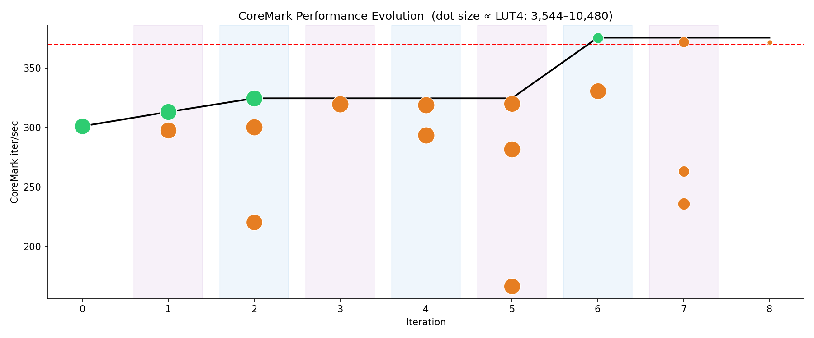

# auto-arch-tournament

An autonomous research loop pointed at a SystemVerilog RV32IM CPU. Each round
the agent proposes a microarchitectural hypothesis, implements it in an
isolated git worktree, then runs it through riscv-formal + Verilator cosim +
3-seed FPGA place-and-route. Only hypotheses that beat the current champion
on CoreMark/MHz get merged.

## What came out of it



73 hypotheses, 9h 51m wall-clock. Locked baseline → champion went from
**301 iter/s (2.23 CoreMark/MHz)** to **577 iter/s (2.91 CoreMark/MHz)** —
+92% on fitness, +26% over VexRiscv's published 2.30 CoreMark/MHz, with
40% fewer LUTs.

The 10 accepted winners, in order of merge:

| Δt   | iter/s | CM/MHz | Fmax    | Hypothesis                                    |
|------|--------|--------|---------|-----------------------------------------------|
| 0.0h | 301.04 | 2.226  | 135 MHz | Baseline                                      |
| 0.4h | 313.10 | 2.320  | 135 MHz | Backward-Branch Taken Predictor               |
| 0.7h | 324.48 | 2.348  | 138 MHz | IF Direct-Jump Predictor                      |
| 2.1h | 375.43 | 2.348  | 160 MHz | Cold Multi-Cycle DIV/REM Unit                 |
| 2.7h | 397.55 | 2.366  | 168 MHz | One-Deep Store Retirement Slot                |
| 3.5h | 422.77 | 2.366  | 179 MHz | Segmented RVFI Order Counter                  |
| 3.8h | 472.96 | 2.891  | 164 MHz | Registered Lookahead I-Fetch Replay Predictor |
| 4.0h | 505.65 | 2.891  | 175 MHz | Compressed Resetless I-Fetch Replay Tags      |
| 5.3h | 529.35 | 2.891  | 183 MHz | RTL-Only Hot/Cold ALU Opcode Split            |
| 6.1h | 577.76 | 2.908  | 199 MHz | Banked Registered I-Fetch Replay Predictor    |

Full writeup: [docs/auto-arch-tournament-blog-post.md](docs/auto-arch-tournament-blog-post.md).

## Setup

macOS only for now. One-time toolchain install:

```
bash setup.sh
```

Fetches Verilator, OSS CAD Suite (yosys, nextpnr-himbaechel, sby, bitwuzla),
the riscv-none-elf cross compiler, and a few Python deps into `.toolchain/`.
Tools already on `$PATH` are detected and reused.

You'll also need a coding-agent CLI. Codex is the default; Claude Code works
too — pass `AGENT=claude` to any orchestrator target.

## Run the loop

```
make next                         # 1 round, 1 slot, codex — smoke test
make loop N=10 K=3                # 10 rounds, 3 parallel slots per round
make loop N=10 K=3 AGENT=claude   # same, but Claude Code

make report                       # summary of experiments/log.jsonl
```

What each round does:

1. Hypothesis agent emits `experiments/hypotheses/hyp-<id>.yaml`, schema-checked.
2. Implementation agent edits `rtl/` (and optionally `test/test_*.py`) in an isolated git worktree.
3. Eval gate runs: `make formal` → `make cosim` → `make fpga` (3-seed P&R + bracketed CoreMark cycles).
4. Higher fitness → worktree merges into `main`, becomes the new champion. Regression / broken / placement-failed → worktree destroyed, log entry written, next round.

Other useful targets:

```
make lint     # verilator lint on rtl/
make test     # cocotb unit tests
make cosim    # cosim alone (no orchestrator)
make formal   # riscv-formal fast suite (ALTOPS — see CLAUDE.md)
make fpga     # FPGA eval alone
make bench    # build selftest.elf / coremark.elf
make clean    # nuke build artifacts and worktrees
```

If you SSH-sign your commits and run unattended, `tools/orchestrator.py`
sets `commit.gpgsign=false` for its own subprocess tree so the loop
doesn't hang on a 1Password biometric prompt. Manual commits from your
shell are unaffected.

## Philosophy

The orchestrator is hardcoded. The model never edits it. What the model
can touch is small and explicit:

- `rtl/**` — any SystemVerilog file. Add modules, delete modules, rename, restructure, rewrite from scratch. The only top-level invariant is the I/O contract on `core.sv` (clock/reset, imem/dmem, NRET=2 RVFI).
- `test/test_*.py` — cocotb suites. Add tests for new modules.

Everything else is off-limits. The path sandbox in `tools/orchestrator.py`
rejects the round *before* any eval runs if the agent touched `formal/`,
`tools/`, `fpga/`, `test/cosim/main.cpp`, the CRC table, or any other
contract surface. The agent doesn't get to soften its own grader.

The verifier does the heavy lifting:

- **riscv-formal** — symbolic BMC against RV32IM: decode, traps, ordering, liveness, M-ext discipline. ~105 checks at NRET=2.
- **Verilator cosim** — random ~22% bus stalls, RVFI byte-identical against a Python ISS on `selftest.elf` and `coremark.elf`.
- **3-seed P&R** — yosys + nextpnr on a Gowin GW2A-LV18 (Tang Nano 20K). Median Fmax × CoreMark iter/cycle = fitness. One seed is a coin flip; three is comparable across rounds.
- **CoreMark CRC validation** — the four canonical 2K-config CRCs. CoreMark prints "Correct operation validated." even when it isn't, so the bench re-checks them itself.
- **Path sandbox** — the agent cannot edit anything outside `rtl/` and `test/test_*.py`.

Of 73 hypotheses in the run above, 63 were rejected by the verifier. That's the point.

The full contract — invariants, don't-touch list, what may change — is in
[`CLAUDE.md`](CLAUDE.md). The I/O contract is in [`ARCHITECTURE.md`](ARCHITECTURE.md).

## Why this exists

Karpathy's [autoresearch](https://github.com/karpathy/autoresearch) showed
an agent loop finding 20 training-time wins on a nanochat in two days. That
worked because Python and gradient descent are the agent's home turf. This
repo asks whether the recipe generalizes when you point it somewhere it has
no business being good at — SystemVerilog, formal verification, FPGA timing.

It does. But the loop isn't the moat — the loop is commodity. The artifact
that survived 10 wins past 63 rejections wasn't the agent; it was the
verifier. That's the part that encodes what *correct* means in this domain.
The full argument is in the [blog post](docs/auto-arch-tournament-blog-post.md).

## Layout

```
rtl/          # SystemVerilog sources (the design)
test/         # cocotb unit tests + Verilator cosim harness
bench/        # selftest.S, crt0.S, link.ld, EEMBC CoreMark
formal/       # riscv-formal wrapper, checks.cfg, run_all.sh
fpga/         # core_bench.sv, synth.tcl, nextpnr scripts, constraints
tools/        # orchestrator, worktree manager, eval gates, plotting
schemas/      # hypothesis + eval-result JSON schemas
experiments/  # log.jsonl + per-iteration worktrees + progress.png
docs/         # design notes, blog post
```

## Tech stack

| Concern        | Tool                                                            |
|----------------|-----------------------------------------------------------------|
| RTL            | SystemVerilog (IEEE 1800-2017 synthesizable subset)             |
| Sim            | Verilator ≥ 5.0                                                 |
| Unit tests     | cocotb ≥ 1.8 (Python harness over Verilator)                    |
| Formal         | YosysHQ riscv-formal (vendored submodule); sby + bitwuzla       |
| Synth          | Yosys + `synth_gowin`                                           |
| Place & route  | nextpnr-himbaechel (Gowin GW2A-LV18QN88C8/I7 = Tang Nano 20K)   |
| Cross-compiler | xPack riscv-none-elf-gcc 15.x (symlinked to riscv32-unknown-elf)|
| Orchestrator   | Python 3.11+, jsonschema, pyyaml, matplotlib                    |
| Coding agent   | Codex CLI (default) or Claude Code (`AGENT=claude`)             |
